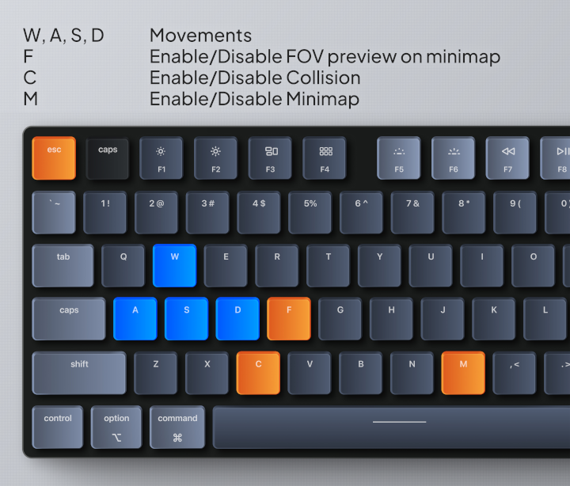

# Cub3D #

## <a name="introduction-en">📖 Introduction ##

The project is inspired by the game Wolfeinstein3D, considered as the first ever FPS. It uses ray-casting to simulate a 3d environment. The goal is to have a dynamic field of view in a maze, where you can move as you wish.
The list of maps is in `map` folder.

You can try the original game on this link :
<http://users.atw.hu/wolf3d/>

## 📋 Table of Contents ##

* [📖 Introduction](#introduction-en)
* [⚙️ Requirements](#requirements-en)
* [🚀 How to start](#start-en)
* [🚀 How to play](#play-en)
* [📝 Bonuses](#bonus-en)

## <a name="requirements-en">⚙️ Requirements ##

Use only the following functions :

* open, close, read, write,
printf, malloc, free,
perror, strerror, exit, gettimeofday
* All functions from `math.h` (-lm man man 3
math)
* All functions from MinilibX given by 42 Lyon

### Multi-threading rendering ###

We use a thread pool to render entire column. We are using `pthread_mutex_t` and `pthread_t` as variables and the functions `pthread_mutex[...]`, `pthread_create` and `pthread_join`. What's new compared to [Philosopher](https://github.com/iDarkAxe/Philosopher) ? We are using `pthread_cond_t` with `pthread_cond_signal` and `pthread_cond_wait` to safely and efficiently wake other threads. In `Philosopher`, we were using `usleep()` to make the thread wait but it waste CPU cycles. `Philosopher` is a scheduling problem where `Cub3D` is a ray-casting optimisation problem.

### How does it work ###

Ray casting is the most basic of many computer graphics rendering algorithms that use the geometric algorithm of ray tracing. Ray tracing-based rendering algorithms operate in image order to render three-dimensional scenes to two-dimensional images. Geometric rays are traced from the eye of the observer to sample the light travelling toward the observer from the ray direction.
The idea behind ray casting is to trace rays from the eye, one per pixel, and find the closest object blocking the path of that ray, with each square in the screen being a pixel. This is then the object the eye sees through that pixel.

## <a name="start-en">🚀 How to start ##

```sh
./cub3D [--generate|-g <WIDTHxHEIGHT>] [--door|-d <path to door texture.xpm>] [--key|-k <path to key texture.xpm>] <path to map.cub>
```

* The cub map file is a required argument
* `--generate`/`-g` generates a random maze with the given size
* `--door`/`-d` requires maze generation. Takes a door texture and generates a door in the maze to leave the maze and "win" the game.
* `--key`/`-k` requires both maze generation and door generation. Takes a key texture and generates a key in the maze that must be picked up for the door to open.

## <a name="play-en">🚀 How to play ##



The controls of the player are the following :

`W_KEY` and `S_KEY` for walking and stepping back.

`A_KEY` and `D_KEY` for walking sideways.

`LEFT_ARROW_KEY` and `RIGHT_ARROW_KEY` for rotation.

The mouse mouvement are converted in left and right rotations.

### Shortcuts ###

`Esc_KEY` for closing program.

`UP_ARROW_KEY` and `DOWN_ARROW_KEY` for changing FOV from 0° to 180°.

`F_KEY` for enabling/disabling FOV preview on minimap.

`C_KEY` for enabling/disabling collision with walls.

`M_KEY` for enabling/disabling minimap.

`C_KEY` for enabling/disabling custom textures filtering.

`V_KEY` for changing filter on textures.

`X_KEY` for applying Black & White filter on textures.

### How to end the game ###

There is no end in normal mode, you can just walk around and see the projection in a all the scenario that you can think of.
In maze mode WITH key-door system, the goal is to find the key and walk the door to finish.
You can try to create the most intricate design and see the result.

## MAP Rules ##

You can see the rules of the map in the documentation folder.
In the `map/` folder, there is also invalid maps to help you understand what is autorized and what isn't.

## <a name="bonus-en">📝 Bonuses ##

* Collisions on wall (no clipping) ✅
* A minimap HUD (to know where you are) ✅
* Keyboard shortcuts to enable features ✅
* Changing the FOV in game ✅
* Windows resolution settings and full-screen ✅
* Random Filter applied to textures ✅
* Black & White Filter mode ✅
* Key-Door system ✅
* FOV Zone raycasting with length limiter ✅
* Multi-threading rendering ✅
* Anti-Aliasing (makes the edges smoother for cleaner lines) ⚠️/!\

---
